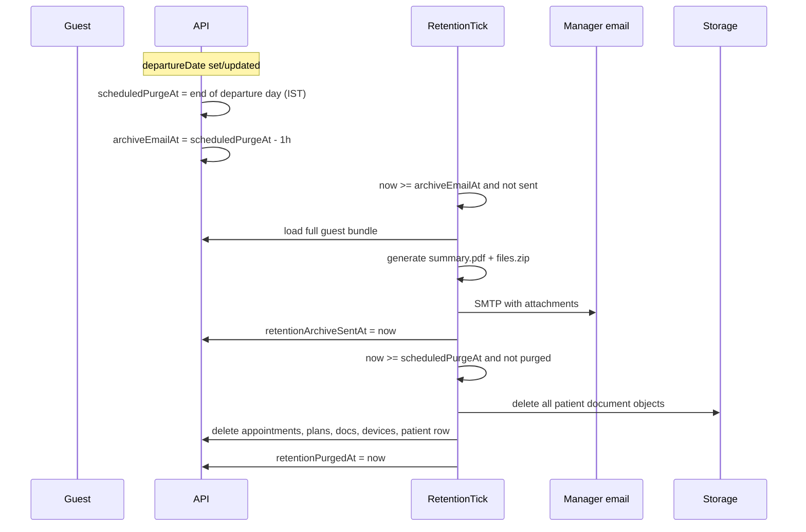

# Plan: Professional guest upload (SOLID) + retention + manager archive PDF

**Product decisions (locked for this plan)**

| Decision | Value |
|----------|--------|
| Upload | **Kept** — guest + staff workflows, PDF-only, policy-gated |
| Purge trigger | **`departureDate` calendar day ends** (institution TZ: `Europe/Istanbul`) |
| Purge scope | **Guest operational data only** (profile, plan, visits, uploaded files, devices/tokens) — **not** institution/manager/admin |
| Pre-purge notice | **1 hour before** purge → email to **primary manager** with **PDF archive** (+ ZIP of uploaded PDFs) |
| Self-service | Guest may **delete own account** → same archive email, purge after **1 hour** (configurable) |
| Apple framing | **Operational / travel documents**, auto-deletion, explicit consent — not a medical records app |

---

## 1. Apple: what we optimize for (not “ban upload”)

Apple rejected **5.1.1(ix)** (regulated health + **Individual** account). Upload is allowed if:

- Purpose = **organization operations** (travel, logistics, assigned files)
- **No clinical** doc types in guest upload (no “Medical History”, “Lab Results” in UI/seed)
- **Privacy Policy** states retention + **automatic deletion on departure**
- **App Privacy** labels match (files, linked to user, app functionality)
- **Review Notes** describe **auto-deletion on departure** + operational file purpose only — **do not** mention manager pre-purge email (internal ops; optional one line in Privacy Policy for institutions)

**Retention + manager export does not replace Organization account** if Apple keeps health classification — enroll in parallel.

---

## 2. Target architecture (SOLID)

New bounded context: **`server/modules/guestRetention/`**

```
guestRetention/
├── domain/
│   ├── GuestRetentionSchedule.ts      # purgeAt, archiveEmailAt
│   └── GuestPurgeScope.ts             # what tables/storage keys delete
├── ports/
│   ├── IGuestRetentionReadRepo.ts     # load guest bundle for export/purge
│   ├── IGuestRetentionWriteRepo.ts    # mark archive sent / purged
│   ├── IGuestArchiveExporter.ts       # build PDF (+ file bundle)
│   ├── IGuestDataPurger.ts            # delete DB + storage (transaction)
│   └── IRetentionMailer.ts            # send archive to manager
├── usecases/
│   ├── ComputeRetentionSchedule.ts    # on departureDate create/update
│   ├── SendPrePurgeArchiveEmail.ts    # T-1h, idempotent
│   ├── PurgeGuestOperationalData.ts   # at purgeAt, idempotent
│   ├── RequestGuestSelfDeletion.ts    # guest-initiated
│   └── RunRetentionTick.ts            # scheduler entry (both jobs)
├── infra/
│   ├── GuestRetentionReadRepo.drizzle.ts
│   ├── GuestDataPurger.drizzle.ts
│   ├── PdfGuestArchiveExporter.ts     # pdfkit → Buffer
│   ├── RetentionMailer.ts             # uses EmailProvider + attachments
│   └── guestRetention.scheduler.ts    # 15-min tick
└── guestRetention.routes.ts           # optional admin diagnostics
```

Refactor upload into **`server/modules/guestDocuments/`** (thin, policy-first):

```
guestDocuments/
├── ports/
│   ├── IDocumentUploadPolicy.ts       # allowlist, size, mime, not past departure
│   └── IGuestDocumentStorage.ts       # wraps StorageProvider
├── usecases/
│   └── UploadGuestDocument.ts         # single entry from uploadRoutes
└── infra/
    ├── OperationalDocumentUploadPolicy.ts
    └── GuestDocumentStorageAdapter.ts
```

**Dependency rule:** `uploadRoutes.ts` → use case → ports (no Drizzle in route).

---

## 3. Retention timeline



**Guest self-delete:** `scheduledPurgeAt = now + 1h`, `archiveEmailAt = now` (send archive immediately), then purge at `scheduledPurgeAt`.

---

## 4. What the manager PDF contains (Apple-safe wording)

**File 1 — `guest-summary-{guestKey}-{date}.pdf` (generated)**

| Section | Content |
|---------|---------|
| Header | Institution name, export timestamp, scheduled deletion time |
| Profile | Name, nationality, travel dates, contact (as stored), access key |
| Plan | Current step, hotel/transport summary |
| Visits | List (title, time, provider name) — label **“Visits”** |
| Files | Table: type name, status, filename, uploadedAt (**no file bytes** in summary PDF) |
| Footer | “Auto-deleted per retention policy. Operational export only — not a medical record.” |

**File 2 — `guest-files-{guestKey}.zip` (optional but recommended)**

- All **uploaded PDFs** from storage (passport, visa, etc.)
- Keeps “tüm datalar” literal without embedding binary in one PDF

**Email body:** neutral copy, link to support, **do not** use patient/clinic/medical in subject.

Suggested subject: `Healory — Guest data archive before scheduled deletion ({guestKey})`

---

## 5. Database changes

Add to `patients` (or `patient_retention` 1:1):

| Column | Type | Purpose |
|--------|------|---------|
| `scheduledPurgeAt` | `timestamptz` | End of departure day (or self-delete +1h) |
| `retentionArchiveSentAt` | `timestamptz` null | Idempotent email |
| `retentionPurgedAt` | `timestamptz` null | Idempotent purge |
| `retentionSource` | `enum` | `DEPARTURE` \| `SELF_DELETE` |

**On `departureDate` insert/update** (manager API): recompute `scheduledPurgeAt` via `ComputeRetentionSchedule`.

**Billing:** keep anonymized `billing_events` row if legally required (no PII) — document in privacy policy.

---

## 6. Upload system (professional + Apple-aligned)

### 6.1 Policy (`OperationalDocumentUploadPolicy`)

| Rule | Implementation |
|------|----------------|
| MIME | `application/pdf` only (existing) |
| Size | ≤ 10 MB (existing) |
| Type | Manager-defined document types (name + description per institution) |
| Authorization | Guest may upload **only** types **assigned** to them by manager |
| Retention | Reject if `now >= scheduledPurgeAt` or `retentionPurgedAt` set |
| Rate limit | Keep existing limiter |

**No global allowlist** — assignment is the gate. Manager creates types in Settings → Document Types; assigns per guest on guest detail.

### 6.2 UI (Expo)

| Task | Detail |
|------|--------|
| Re-enable | Documents segment on `track.tsx` (feature flag `EXPO_PUBLIC_GUEST_UPLOAD_ENABLED`) |
| Consent | Modal: “Files deleted on {departureDate}”, link privacy |
| Self-delete | Profile → “Delete my account” → confirm → API |
| Copy | Files / Institution / Guest — never “medical documents” |

### 6.3 Email provider

Extend `EmailMessage`:

```ts
attachments?: { filename: string; content: Buffer; contentType: string }[];
```

Update `SmtpEmailProvider` + `ConsoleEmailProvider` for dev.

---

## 7. Task backlog (implementation order)

### Epic A — Foundation (schema + SOLID skeleton)

| ID | Task | Acceptance |
|----|------|------------|
| A1 | Migration: `scheduledPurgeAt`, `retentionArchiveSentAt`, `retentionPurgedAt`, `retentionSource` | ✅ `db:push` |
| A2 | `ComputeRetentionSchedule` on patient create/update when `departureDate` set | ✅ + unit tests |
| A3 | Scaffold `guestRetention` module | ✅ `server/modules/guestRetention/` |
| A4 | Scaffold `guestDocuments` + `UploadGuestDocument` use case | ✅ upload route delegates |

### Epic B — Upload hardening

| ID | Task | Acceptance |
|----|------|------------|
| B1 | `OperationalDocumentUploadPolicy` — assignment-based | ✅ |
| B2 | `AssignDocumentsToGuest` use case + route delegate | ✅ |
| B3 | Guest Track: Plan \| Files tabs + retention hint | ✅ |
| B4 | Delete doc type blocked when assigned (`DOC-TYPE-002`) | ✅ |
| B5 | Manager AssignDocTypeSheet i18n | ✅ |

### Epic C — Archive PDF + email (T−1h)

| ID | Task | Acceptance |
|----|------|------------|
| C1 | Add `pdfkit` (or `pdf-lib`) dependency | Server build OK |
| C2 | `IGuestArchiveExporter` → summary PDF buffer | Snapshot test structure |
| C3 | ZIP builder for stored PDFs (`archiver`) | All keys for patient |
| C4 | `IGuestRetentionReadRepo` — full bundle query | Reuse `fetchGuestDetail` internally |
| C5 | Extend `EmailProvider` attachments | Dev console logs filenames |
| C6 | `SendPrePurgeArchiveEmail` — resolve manager email (primary manager → clinic contact) | Idempotent |
| C7 | Email templates `guestArchiveEmailHtml` | Neutral wording |
| C8 | `retentionArchiveSentAt` only set after successful send | Retry safe |

### Epic D — Purge at departure

| ID | Task | Acceptance |
|----|------|------------|
| D1 | `IGuestDataPurger` — storage delete all keys | No orphan S3 objects |
| D2 | DB transaction: documents, appointments, plan, devices, refresh_tokens, patient | FK order correct |
| D3 | `PurgeGuestOperationalData` idempotent | Second call no-op |
| D4 | `RunRetentionTick` every **15 min** (IST) | Logs + `job_runs` row |
| D5 | Manual script `scripts/run-retention-tick.ts` | `--dry-run` |

### Epic E — Guest self-delete

| ID | Task | Acceptance |
|----|------|------------|
| E1 | `POST /v1/patient/account/delete` + confirm body | 401 without guest token |
| E2 | `RequestGuestSelfDeletion` — archive now, purge +1h | Audit log |
| E3 | Profile UI + i18n tr/en/es/ru | Double confirm |
| E4 | Invalidate tokens after purge | Guest cannot log in |

### Epic F — Apple & legal surface

| ID | Task | Acceptance |
|----|------|------------|
| F1 | Privacy policy § retention, manager archive, self-delete | ✅ `docs/privacy/index.html` |
| F2 | Support page FAQ | ✅ `docs/support/index.html` |
| F3 | App Privacy questionnaire update | ✅ `APP_STORE_REVIEW.md` §4 |
| F4 | Review Notes: ops platform + departure deletion + assigned files only (**no** manager archive email) | ✅ `APP_STORE_REVIEW.md` §5 |
| F5 | Screenshots: upload consent + “deleted on departure” | ⬜ ASC capture |
| F6 | Organization account track (parallel) | ⬜ Business owner |

### Epic G — QA

| ID | Task | Acceptance |
|----|------|------------|
| G1 | Integration: guest with departure tomorrow → email at T−1h (mock clock) | |
| G2 | Integration: purge removes DB + storage | |
| G3 | Self-delete flow E2E | |
| G4 | `smoke:api` + prod seed guest | 🔴 prod: PT-4S9WQ2U6 401; retention route 404 until deploy |

---

## 8. Suggested sprint order (2–3 weeks)

```
Week 1: A1–A4, B1–B2, C1–C5
Week 2: C6–C8, D1–D5, B3–B4
Week 3: E1–E4, F1–F5, G1–G4
```

**Parallel:** F6 Organization enrollment (weeks, not blocked on engineering).

---

## 9. Environment variables

| Variable | Example | Purpose |
|----------|---------|---------|
| `GUEST_RETENTION_TZ` | `Europe/Istanbul` | Purge end-of-day |
| `GUEST_ARCHIVE_LEAD_HOURS` | `1` | Email before purge |
| `GUEST_SELF_DELETE_DELAY_HOURS` | `1` | After self-delete request |
| `GUEST_UPLOAD_ALLOWLIST` | `PASSPORT_COPY,VISA,...` | Policy |
| `EXPO_PUBLIC_GUEST_UPLOAD_ENABLED` | `true` | Client flag |

---

## 10. Risks & mitigations

| Risk | Mitigation |
|------|------------|
| Manager has no email | Fallback `clinic.contactEmail`; log CRITICAL; delay purge 24h retry |
| Large ZIP / SMTP limits | Cap ZIP 25 MB; if over, summary PDF only + “files too large, download from app before deletion” (v2) |
| Email fails at T−1h | Retry every 15 min until purge; if still fail, **skip purge** and alert admin (config) |
| Apple still 5.1.1(ix) | Organization account + neutral metadata |
| GDPR/KVKK | Privacy policy + DPA; manager is controller |

---

## 11. Code touchpoints (existing)

| Area | File |
|------|------|
| Upload route | `server/api/uploadRoutes.ts` |
| Guest detail bundle | `server/modules/managerGuestDetail/guestDetail.repo.ts` |
| Scheduler pattern | `server/billing/scheduler.ts` |
| Storage | `server/storage/*` |
| Guest track UI | `app/(patient)/track.tsx` |
| Guest profile | `app/(patient)/profile.tsx` |

---

## 12. Open confirmations (defaults assumed above)

1. **Purge moment:** end of `departureDate` in Istanbul — OK?  
2. **Manager recipient:** primary manager email, else institution contact — OK?  
3. **Self-delete delay:** 1 hour after request (same as archive lead) — OK?  
4. **ZIP + summary PDF** both attached — OK?

Confirm → start **Epic A1** implementation.
